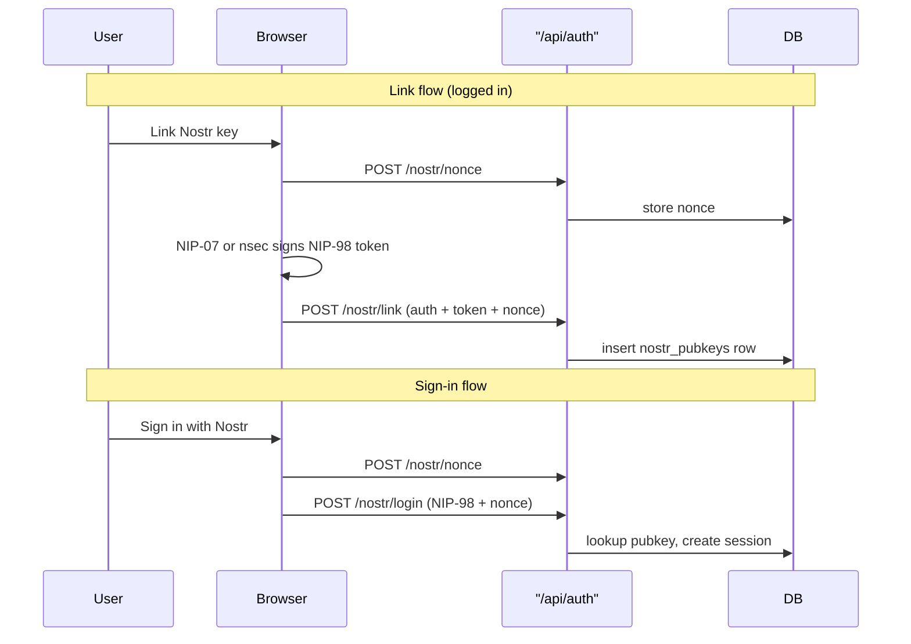

# Install better-auth-nostr

## Context

[better-auth-nostr](https://github.com/leon-wbr/better-auth-nostr) (npm `0.2.0`) adds NIP-98 Nostr login to Better Auth. Your starterkit already follows the standard plugin pattern in [`src/lib/auth.ts`](src/lib/auth.ts) and [`src/lib/auth-client.ts`](src/lib/auth-client.ts), with schema managed via `pnpm db:sync` (same flow used for passkey, invite, etc.).

**Your choices:**
- Add a Nostr sign-in button on `/auth/sign-in`
- Only allow sign-in for **pre-linked** pubkeys (`disableImplicitSignUp: true`)

The plugin's `addPubkey` endpoint is commented out in upstream source, so linking must be implemented locally for this policy to work.



## 1. Install package

```bash
pnpm add better-auth-nostr
```

Package is published on npm at `0.2.0` and peers with your current `better-auth@^1.6.22`. It pulls in `nostr-tools` as a dependency.

## 2. Server plugin — [`src/lib/auth.ts`](src/lib/auth.ts)

- Import `nostr` from `"better-auth-nostr"`
- Add to `plugins` array (after `passkey()`, before infra plugins):

```ts
nostr({
  disableImplicitSignUp: true,
}),
```

With `disableImplicitSignUp`, unknown pubkeys receive `"Nostr pubkey not registered"` from the plugin's login handler.

**Caveats to be aware of:**
- Nostr login creates a session directly and does **not** go through your existing `twoFactor()` challenge — users with 2FA enabled could still sign in via a linked Nostr key without TOTP/passkey.
- Auto-created users (not applicable with your policy) would get placeholder emails like `{npub}@anchorman.lol`; linked users keep their existing email account.

## 3. Custom link plugin — new [`src/lib/plugins/nostr-link.ts`](src/lib/plugins/nostr-link.ts)

Add a small Better Auth plugin with one endpoint: `POST /nostr/link`

Logic (mirrors upstream [`routes.ts`](https://github.com/leon-wbr/better-auth-nostr/blob/main/src/routes.ts) login validation):
1. Require an authenticated session (`ctx.context.session`)
2. Read `Authorization` NIP-98 token + `{ nonce }` body
3. Validate event signature and nonce (reuse `nostr-tools/nip98` + verification table keyed `nostr:{pubkey}`)
4. Reject if pubkey already linked to a **different** user
5. Insert into `nostrPubkey` model for `session.user.id` (skip if already linked to same user)
6. Return `{ publicKey }` on success

Register in [`src/lib/auth.ts`](src/lib/auth.ts):

```ts
import { nostrLink } from "@/lib/plugins/nostr-link"

// in plugins array, immediately after nostr():
nostrLink(),
```

## 4. Client plugin — [`src/lib/auth-client.ts`](src/lib/auth-client.ts)

- Import `nostrClient` from `"better-auth-nostr/client"`
- Add `nostrClient()` to the `plugins` array
- Add PostHog events in `authEventsByPath`:
  - `"/nostr/login": "nostr_sign_in"`
  - `"/nostr/link": "nostr_key_linked"`

## 5. Client link helper — new [`src/lib/nostr-link-client.ts`](src/lib/nostr-link-client.ts)

Thin wrapper around the same NIP-98 signing flow used by `nostrClient`, but POSTs to `/nostr/link` with the session cookie. Reuse signing logic patterns from the plugin's [`client.ts`](https://github.com/leon-wbr/better-auth-nostr/blob/main/src/client.ts) (NIP-07 extension or optional `nsec`).

## 6. Database migration

```bash
pnpm db:sync
```

This runs `auth generate` → updates [`auth-schema.ts`](auth-schema.ts) with a `nostr_pubkeys` table (pluralized for your `usePlural: true` Drizzle adapter) → generates and applies a new migration under [`migrations/`](migrations/).

Expected columns: `id`, `name`, `publicKey` (unique), `userId` (FK → `users`), `createdAt`.

## 7. TypeScript — `window.nostr`

Add [`src/types/nostr.d.ts`](src/types/nostr.d.ts) for NIP-07 browser extension typing (`getPublicKey`, `signEvent`) so link/sign-in components type-check cleanly.

## 8. Sign-in UI — [`src/app/auth/[path]/page.tsx`](src/app/auth/[path]/page.tsx)

Follow the existing [`TwoFactorView`](src/components/two-factor-view.tsx) / [`Passkey2faButton`](src/components/passkey-2fa-button.tsx) pattern:

- New [`src/components/nostr-sign-in-button.tsx`](src/components/nostr-sign-in-button.tsx)
  - Uses `AuthUIContext` for `navigate`, `redirectTo`, `localization`
  - Primary path: NIP-07 (`authClient.signIn.nostr()`)
  - Detects `window.nostr`; hides or disables when absent
  - On error `"Nostr pubkey not registered"`, show a toast directing users to link a key in account settings first
  - On success, navigate to `redirectTo` (default `/account/settings`)

- For `path === "sign-in"`, render `AuthView` with `cardFooter` containing an "or continue with" separator + `NostrSignInButton` (same slot pattern as 2FA page)

## 9. Link-key UI — new [`src/app/account/nostr/page.tsx`](src/app/account/nostr/page.tsx)

Protected page (middleware already guards `/account/settings`; extend [`src/middleware.ts`](src/middleware.ts) matcher to include `/account/nostr`).

Page contents:
- New [`src/components/link-nostr-key.tsx`](src/components/link-nostr-key.tsx) — button calling the link helper
- Brief copy: users must sign in with email/password first, then link their Nostr key here before using Nostr sign-in
- Optional: link from account settings sidebar (a simple text link in the page header is enough for v1)

## 10. Verification

Manual test plan:
1. Sign in with email/password
2. Visit `/account/nostr`, link key via NIP-07 extension
3. Sign out, visit `/auth/sign-in`, sign in with Nostr — should succeed
4. Try Nostr sign-in with an unlinked pubkey — should fail with clear error
5. Run `pnpm check-types` and `pnpm build`

No new environment variables are required (`BETTER_AUTH_URL` is already used as the NIP-98 request URL base).
